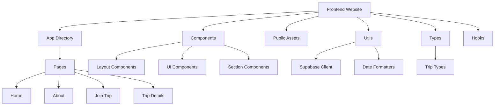
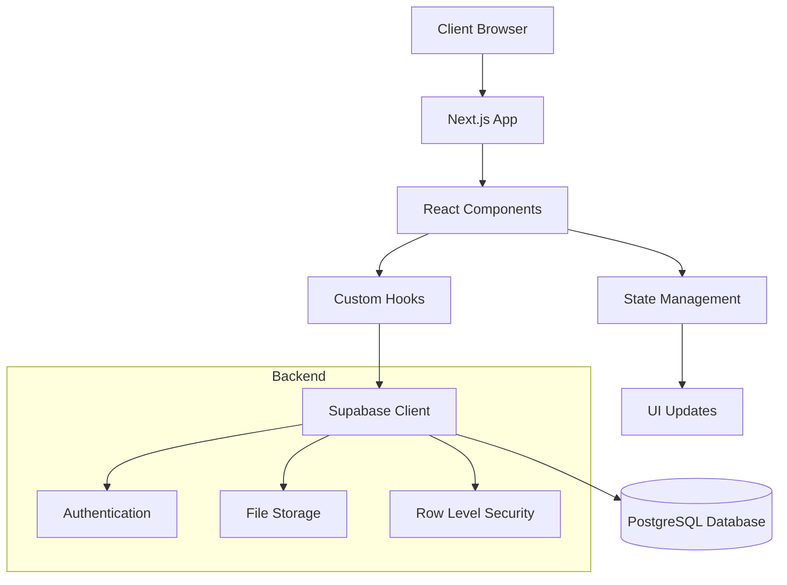
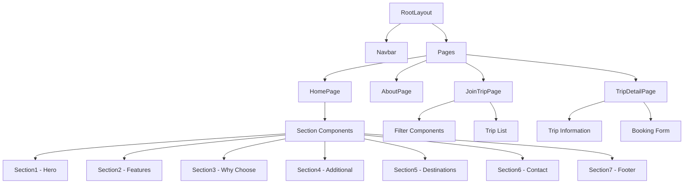

# TourCrow Website Documentation

## Project Overview
TourCrow is a modern travel platform that connects travelers with influencers for unique travel experiences. The website is built using Next.js 13+, TypeScript, and Tailwind CSS, focusing on providing a seamless user experience for booking and managing travel experiences.

### Purpose
- Connect travelers with social media influencers for unique travel experiences
- Provide curated 3-5 day themed trips
- Offer exclusive access to influencer-led experiences
- Create community-driven travel experiences

### Development Goals
- Create a responsive, mobile-first design
- Implement seamless booking flow
- Ensure high performance and SEO optimization
- Maintain scalable and maintainable code structure

## Tech Stack

### Frontend Framework
- **Next.js 13+**
  - App Router for improved routing
  - Server Components for better performance
  - Image optimization with next/image
  - Built-in API routes

### Programming Language
- **TypeScript**
  - Type safety and better developer experience
  - Enhanced code maintainability
  - Better IDE support and autocompletion
  - Interfaces for data models

### Styling
- **Tailwind CSS**
  - Utility-first CSS framework
  - Custom configuration in tailwind.config.ts
  - Custom color scheme and breakpoints
  - JIT (Just-In-Time) compilation

### Backend & Database
- **Supabase**
  - PostgreSQL database
  - Real-time subscriptions
  - Row Level Security (RLS)
  - Built-in authentication
  - Database backup and restoration

### Development Tools
- **ESLint**: Code linting and style enforcement
- **Prettier**: Code formatting
- **PostCSS**: CSS processing
- **TypeScript Config**: Strict type checking

## Project Architecture

### High-Level Architecture


### Data Flow Architecture


### Component Hierarchy


## Directory Structure

### Core Directories

#### `/app` (Next.js 13+ App Router)
Main application pages and routing structure:
```
/app
├── layout.tsx           # Root layout with metadata and shared UI
├── page.tsx            # Homepage component
├── globals.css         # Global styles and Tailwind directives
├── about/             
│   └── page.tsx        # About page component
├── join-trip/
│   └── page.tsx        # Trip listing and search page
└── trip/
    └── [id]/           # Dynamic route for trip details
        ├── page.tsx    # Trip details page
        └── booking.tsx # Booking form component
```

#### `/components` (React Components)
Reusable components organized by functionality:
```
/components
├── Navbar.tsx          # Main navigation component
├── FadeContent.tsx     # Animation wrapper component
├── Section1.tsx        # Hero section with brand messaging
├── Section2.tsx        # Features overview section
├── Section3.tsx        # Why choose us section
├── Section4.tsx        # Additional features section
├── Section5.tsx        # Interactive destinations section
├── Section6.tsx        # Contact form section
├── Section7.tsx        # Footer section
├── Toaster.tsx         # Toast notification wrapper
└── ui/                 # Reusable UI components
    ├── Toast.tsx       # Toast notification component
    └── use-toast.tsx   # Toast hook implementation
```

#### `/public` (Static Assets)
Optimized static assets with descriptive naming:
```
/public
├── Logo.svg            # Brand logo
├── TourCrowText.svg    # Brand text logo
├── destination*.jpg    # Trip destination images
├── bg*.png            # Background images
├── *.svg              # Various SVG icons
└── gif/               # Animated GIFs
    └── bird*.gif      # Bird animations
```

#### `/utils` (Utility Functions)
Helper functions and configuration:
```
/utils
├── format-date.ts     # Date formatting and manipulation
└── supabase/
    └── client.ts      # Supabase client config and helpers
```

#### `/types` (TypeScript Definitions)
Type definitions for better code maintainability:
```
/types
└── trips.ts          # Trip-related interfaces and types
    ├── interface Trip
    ├── interface TripActivity
    ├── interface TripInclusion
    └── interface TripExclusion
```

#### `/hooks` (Custom React Hooks)
Reusable React hooks:
```
/hooks
└── use-toast.ts      # Toast notification hook
```

#### `/lib` (Shared Utilities)
Common utilities and helpers:
```
/lib
└── utils.ts          # General utility functions
```

## Routes and Data Flow

### Client-Side Routes

#### 1. `/` - Homepage
- **Component**: `app/page.tsx`
- **Data Flow**: Static content with dynamic sections
- **Components Used**:
  ```typescript
  import Section1 from "@/components/Section1"
  import Section2 from "@/components/Section2"
  import Section3 from "@/components/Section3"
  import Section4 from "@/components/Section4"
  import Section5 from "@/components/Section5"
  import Section6 from "@/components/Section6"
  import Section7 from "@/components/Section7"
  ```

#### 2. `/about` - About Page
- **Component**: `app/about/page.tsx`
- **Data Flow**: Static content with company information
- **Key Features**:
  - Company background
  - Mission statement
  - Service descriptions

#### 3. `/join-trip` - Trip Listing Page
- **Component**: `app/join-trip/page.tsx`
- **Data Operations**:
  ```typescript
  // Fetch Trips
  const fetchTrips = async () => {
    const data = await getTrips(
      filters.destination,
      filters.startDateAfter ? new Date(filters.startDateAfter) : null,
      filters.startDateBefore,
      filters.minPrice ? Number.parseFloat(filters.minPrice) : null,
      filters.maxPrice ? Number.parseFloat(filters.maxPrice) : null,
      filters.category ? [filters.category] : []
    )
    setTrips(data)
  }

  // Fetch Categories
  const fetchCategories = async () => {
    const { data, error } = await supabase
      .from("trip_influencers")
      .select("influencer_category")
  }
  ```
- **State Management**:
  ```typescript
  interface FilterState {
    destination: string
    startDateAfter: string | null
    startDateBefore: Date | null
    minPrice: string
    maxPrice: string
    category: string
  }
  ```

#### 4. `/trip/[id]` - Trip Detail Page
- **Component**: `app/trip/[id]/page.tsx`
- **Data Operations**:
  ```typescript
  const fetchTripDetails = async () => {
    // Fetch trip details
    const { data: tripData } = await supabase
      .from("trip_influencers")
      .select(`
        *,
        trips:trip_id (*)
      `)
      .eq("id", tripId)
      .single()

    // Fetch activities
    const { data: activitiesData } = await supabase
      .from("trip_activities")
      .select("*")
      .eq("trip_id", tripId)

    // Fetch inclusions/exclusions
    const { data: inclusionsData } = await supabase
      .from("trip_inclusions")
      .select("*")
      .eq("trip_id", tripId)
  }
  ```

### API Routes and Data Operations

#### 1. Trip Management

##### Fetch Trips
```typescript
// GET /api/trips
export async function getTrips(
  destination?: string,
  startDateAfter?: Date | null,
  startDateBefore?: Date | null,
  minPrice?: number | null,
  maxPrice?: number | null,
  categories?: string[]
) {
  let query = supabase.from("trips").select("*")

  if (destination) {
    query = query.ilike("destination", `%${destination}%`)
  }
  if (startDateAfter) {
    query = query.gte("start_date", startDateAfter.toISOString())
  }
  if (startDateBefore) {
    query = query.lte("start_date", startDateBefore.toISOString())
  }
  if (minPrice) {
    query = query.gte("price", minPrice)
  }
  if (maxPrice) {
    query = query.lte("price", maxPrice)
  }
  if (categories && categories.length > 0) {
    query = query.in("category", categories)
  }

  const { data, error } = await query

  if (error) throw error
  return data
}
```

##### Create Booking
```typescript
// POST /api/bookings
export async function createBooking(booking: BookingData) {
  const { data, error } = await supabase
    .from("bookings")
    .insert([
      {
        trip_id: booking.tripId,
        first_name: booking.firstName,
        last_name: booking.lastName,
        email: booking.email,
        phone: booking.phone,
        gender: booking.gender,
        date_of_birth: booking.dateOfBirth,
        instagram_handle: booking.instagramHandle,
        country: booking.country
      }
    ])
    .select()

  if (error) throw error
  return data
}
```

##### Form Submission
```typescript
// POST /api/contact
export async function submitContactForm(formData: ContactFormData) {
  const { data, error } = await supabase
    .from("contact_submissions")
    .insert([
      {
        name: formData.name,
        email: formData.email,
        message: formData.message
      }
    ])

  if (error) throw error
  return data
}
```

#### 2. Trip Details APIs

##### Fetch Trip Details
```typescript
// GET /api/trips/[id]
export async function getTripDetails(tripId: string) {
  const { data: trip, error: tripError } = await supabase
    .from("trip_influencers")
    .select(`
      *,
      trips:trip_id (
        group_size_min,
        group_size_max,
        meals_included,
        accommodation,
        description
      )
    `)
    .eq("id", tripId)
    .single()

  if (tripError) throw tripError
  return trip
}
```

##### Fetch Trip Activities
```typescript
// GET /api/trips/[id]/activities
export async function getTripActivities(tripId: string) {
  const { data, error } = await supabase
    .from("trip_activities")
    .select("*")
    .eq("trip_id", tripId)
    .order("sequence", { ascending: true })

  if (error) throw error
  return data
}
```

##### Fetch Trip Inclusions/Exclusions
```typescript
// GET /api/trips/[id]/inclusions
export async function getTripInclusions(tripId: string) {
  const { data, error } = await supabase
    .from("trip_inclusions")
    .select("*")
    .eq("trip_id", tripId)

  if (error) throw error
  return data
}

// GET /api/trips/[id]/exclusions
export async function getTripExclusions(tripId: string) {
  const { data, error } = await supabase
    .from("trip_exclusions")
    .select("*")
    .eq("trip_id", tripId)

  if (error) throw error
  return data
}

## Component Details

### Layout Components
1. `Navbar.tsx`
   - Main navigation
   - Responsive design
   - Logo and menu items

### Section Components
1. `Section1.tsx` - Hero Section
   - Main banner with animated elements
   - Call-to-action buttons
   - Brand messaging

2. `Section2.tsx` - Features Overview
   - Why choose TourCrow
   - Key benefits
   - Value propositions

3. `Section3.tsx` - Why Choose Us
   - Feature grid
   - Icons and descriptions
   - USP highlights

4. `Section4.tsx` - Additional Features
   - Secondary features
   - User benefits

5. `Section5.tsx` - Destinations
   - Interactive destination showcase
   - Animated path with location markers
   - Location information

6. `Section6.tsx` - Contact Form
   - Contact information
   - Form submission
   - Social links

7. `Section7.tsx` - Footer
   - Navigation links
   - Contact information
   - Social media links
   - Copyright

## Features

### Trip Management
- Trip listing with filters
- Advanced search functionality
- Detailed trip views
- Booking system

### User Interface
- Responsive design
- Modern animations
- Interactive elements
- Toast notifications

### Filtering System
- Destination search
- Date range selection
- Price range filters
- Category filters

## Database Integration

### Supabase Configuration
- **Environment Setup**
  ```typescript
  // utils/supabase/client.ts
  import { createClient } from '@supabase/supabase-js'

  const supabaseUrl = process.env.NEXT_PUBLIC_SUPABASE_URL
  const supabaseAnonKey = process.env.NEXT_PUBLIC_SUPABASE_ANON_KEY

  export const supabase = createClient(supabaseUrl, supabaseAnonKey)
  ```

### Database Schema

#### `trips` Table
Main trip information:
```sql
create table trips (
    id uuid primary key default uuid_generate_v4(),
    destination text not null,
    start_date timestamp with time zone not null,
    end_date timestamp with time zone not null,
    price decimal(10,2) not null,
    group_size_min integer,
    group_size_max integer,
    meals_included text,
    accommodation text,
    description text,
    created_at timestamp with time zone default now()
);
```

#### `trip_influencers` Table
Influencer details and relationships:
```sql
create table trip_influencers (
    id uuid primary key default uuid_generate_v4(),
    trip_id uuid references trips(id),
    influcencer_name text not null,
    influencer_category text,
    description text,
    social_media_handle text
);
```

#### `trip_activities` Table
Activities for each trip:
```sql
create table trip_activities (
    id uuid primary key default uuid_generate_v4(),
    trip_id uuid references trips(id),
    name text not null,
    description text,
    category text,
    is_optional boolean default false,
    duration interval
);
```

#### `trip_inclusions` Table
What's included in the trip:
```sql
create table trip_inclusions (
    id uuid primary key default uuid_generate_v4(),
    trip_id uuid references trips(id),
    item text not null,
    details text
);
```

#### `trip_exclusions` Table
What's not included in the trip:
```sql
create table trip_exclusions (
    id uuid primary key default uuid_generate_v4(),
    trip_id uuid references trips(id),
    item text not null,
    details text
);
```

### Database Queries
Example queries used in the application:

1. **Fetch Trip Details**
```typescript
const { data: tripData, error } = await supabase
    .from("trip_influencers")
    .select(`
        *,
        trips:trip_id (
            group_size_min,
            group_size_max,
            meals_included,
            accommodation,
            description
        )
    `)
    .eq("id", tripId)
    .single();
```

2. **Filter Trips**
```typescript
const { data: trips } = await supabase
    .from("trips")
    .select("*")
    .gte("start_date", startDate)
    .lte("start_date", endDate)
    .gte("price", minPrice)
    .lte("price", maxPrice)
    .in("category", categories);
```

### Data Models
TypeScript interfaces for database entities:

```typescript
// types/trips.ts
export interface Trip {
    id: string;
    destination: string;
    start_date: string;
    end_date: string;
    price: number;
    influcencer_name: string;
    influencer_category: string;
    description?: string;
}

export interface TripActivity {
    id: string;
    trip_id: string;
    name: string;
    description: string;
    category: string;
    is_optional: boolean;
}

// Additional interfaces...
```

## Styling

### Design System
- Color Scheme:
  - Primary: #FEC90F (Yellow)
  - Secondary: #231f20 (Dark)
  - Background: #fffbe5 (Light Yellow)
- Typography:
  - Font: Montserrat Alternates
  - Various weights for different purposes
- Responsive Design:
  - Mobile-first approach
  - Breakpoints for tablets and desktop

## Additional Information

## Development Guidelines

### Performance Optimizations

#### Image Optimization
```typescript
// Example of optimized image usage
import Image from 'next/image'

export default function OptimizedImage() {
  return (
    <Image
      src="/destination1.jpg"
      alt="Destination"
      width={800}
      height={600}
      priority={true} // For above-the-fold images
      loading="lazy"  // For below-the-fold images
    />
  )
}
```

#### Component Optimization
1. **Lazy Loading**
```typescript
// Example of lazy loading components
import dynamic from 'next/dynamic'

const DynamicSection = dynamic(() => import('@/components/Section5'), {
  loading: () => <p>Loading...</p>,
  ssr: false // If component requires browser APIs
})
```

2. **State Management**
```typescript
// Example of optimized state usage
const [filters, setFilters] = useState<FilterState>({
  destination: "",
  startDateAfter: "",
  startDateBefore: null,
  minPrice: "",
  maxPrice: "",
  category: "",
})

// Debounced filters for performance
const [debouncedFilters, setDebouncedFilters] = useState(filters)

useEffect(() => {
  const handler = setTimeout(() => {
    setDebouncedFilters(filters)
  }, 500)
  return () => clearTimeout(handler)
}, [filters])
```

### SEO Implementation

#### Meta Tags
```typescript
// app/layout.tsx
import type { Metadata } from "next"

export const metadata: Metadata = {
  title: "TourCrow",
  description: "Bridging the gap with influencers",
  keywords: "travel, influencer, trips, tourism",
  openGraph: {
    title: "TourCrow - Travel with Influencers",
    description: "Join unique travel experiences led by influencers",
    images: ['/og-image.jpg']
  }
}
```

#### Semantic Structure
```html
<!-- Example of semantic HTML structure -->
<article className="trip-card">
  <header>
    <h2>Trip Title</h2>
    <time dateTime="2024-06-15">June 15, 2024</time>
  </header>
  <main>
    <p>Trip description...</p>
  </main>
  <footer>
    <p>Price: $999</p>
  </footer>
</article>
```

### Accessibility Guidelines

#### ARIA Implementation
```typescript
// Example of accessible component
export function FilterButton({ isOpen, onClick }: FilterButtonProps) {
  return (
    <button
      aria-expanded={isOpen}
      aria-controls="filter-panel"
      aria-label="Toggle trip filters"
      onClick={onClick}
      className="filter-button"
    >
      <Filter className="w-4 h-4" />
      <span>Filters</span>
    </button>
  )
}
```

#### Keyboard Navigation
```typescript
// Example of keyboard navigation handling
export function NavigationMenu() {
  const handleKeyDown = (e: React.KeyboardEvent) => {
    if (e.key === 'Enter' || e.key === ' ') {
      e.preventDefault()
      // Handle selection
    }
  }

  return (
    <nav role="navigation">
      <ul>
        <li>
          <a
            href="#"
            onKeyDown={handleKeyDown}
            tabIndex={0}
          >
            Menu Item
          </a>
        </li>
      </ul>
    </nav>
  )
}
```

### Security Measures

#### Form Validation
```typescript
// Example of form validation
interface BookingFormData {
  firstName: string
  email: string
  phone: string
}

const validateForm = (data: BookingFormData): ValidationErrors => {
  const errors: ValidationErrors = {}
  
  if (!data.firstName.trim()) {
    errors.firstName = "Name is required"
  }
  
  if (!data.email.match(/^[^\s@]+@[^\s@]+\.[^\s@]+$/)) {
    errors.email = "Valid email is required"
  }
  
  if (!data.phone.match(/^\+?[\d\s-]{10,}$/)) {
    errors.phone = "Valid phone number is required"
  }
  
  return errors
}
```

#### API Security
```typescript
// Example of protected API route
import { createServerSupabaseClient } from '@supabase/auth-helpers-nextjs'

export async function GET(req: Request) {
  const supabase = createServerSupabaseClient()
  
  // Verify authentication
  const { data: { session } } = await supabase.auth.getSession()
  
  if (!session) {
    return new Response('Unauthorized', { status: 401 })
  }
  
  // Process request
  // ...
}
```

### Error Handling
```typescript
// Example of error boundary component
class ErrorBoundary extends React.Component<Props, State> {
  static getDerivedStateFromError(error: Error) {
    return { hasError: true, error }
  }

  componentDidCatch(error: Error, errorInfo: React.ErrorInfo) {
    console.error('Error caught:', error, errorInfo)
    // Log to error tracking service
  }

  render() {
    if (this.state.hasError) {
      return <ErrorFallback error={this.state.error} />
    }
    return this.props.children
  }
}
```
